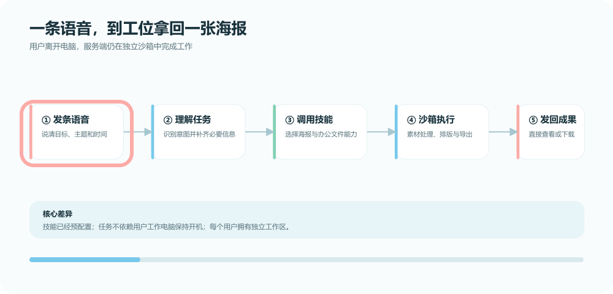

<div align="center">
  
  <p><strong>不用多学一个软件，在熟悉的聊天窗口里，把事情交给微Link。</strong></p>
  <p>
    <a href="LICENSE"></a>
    <a href="LICENSE-COMMERCIAL.md"></a>
    <a href="https://nodejs.org/"></a>
    <a href="https://www.docker.com/"></a>
    <a href="README_EN.md"></a>
  </p>
</div>

<p align="center">
  
</p>

> 微Link是一个自托管、多用户的 AI 助理控制面：把聊天通道、模型、Skills、MCP、记忆、提醒和沙箱执行组织在一起，让一个人可以随时交代，多个人可以各自使用，一台服务可以持续托管。

## 先说人话

你不需要先学会一个新软件。

在哪个聊天工具里顺手，就从哪里开始：微信里发一句话，飞书里补充上下文，回到网页查看结果。适合托管的工作放到服务端自己的沙箱里，电脑睡着了，任务也不必跟着睡着。它还会记住目标、主动问进展；早上告诉你天气和安排，下雨时提前提醒你想想午饭。

微Link最初只是一个有点可爱的想法：七月中旬，我们想通过微信 iLink 接口养一只大家都愿意用的生活助理“小龙虾”，帮人排排日程、查查资讯。真实使用之后，问题一个个冒出来，项目也一点点长成了现在这个能接入多端、能持续办事的 AI 助理。

## 它能帮你什么

| 零门槛 | 跨端记忆 | 持续办事 | 会跟进 |
| --- | --- | --- | --- |
| 扫码领取微Link，无需先安装一套新客户端。 | 微信、企业微信、飞书和网页可以围绕同一个 Bot 继续对话（需完成对应通道配置）。 | 工作在服务端独立沙箱里执行，不依赖你的工作电脑一直开机。 | 记住目标，在合适的时间主动提醒；收到你的回复后，再整理最新状态和下一步。 |

## 一个很具体的例子

出门路上，你发一条语音：“帮我做一张活动海报，主题是周五下午茶，清爽一点。”

微Link在服务端沙箱里准备素材、生成页面并导出图片；到工位时，你看到的不是“我还在思考”，而是一张可以继续修改、发送和使用的海报。

<p align="center">
  
</p>

这只是一个演示。文件整理、资讯检索、天气与日程、日报准备、网页任务和团队协作，都可以用同一套“交代—执行—回传—跟进”的方式接入。

## 为什么它和单机助手不太一样

这里不拿未经验证的跑分或竞品数据做比较，只说部署形态上的差异：

|  | 本地单机任务模式 | 微Link的服务端托管模式 |
| --- | --- | --- |
| 开始使用 | 通常需要先安装、配置和学习工具 | 聊天窗口或网页即可开始，扫码领取 Bot |
| 技能 | 往往从零搭建自己的提示词和工具链 | 可预置一组工作技能，再按用户需要调整 |
| 电脑状态 | 依赖本机进程；休眠或关机可能暂停 | 任务在服务端独立运行，电脑可以离开 |
| 多用户 | 更像一个人一套环境 | 一台服务承载多个用户，每个用户有自己的上下文和工作区 |
| 跟进 | 任务完成后通常需要人再来问 | 可以持久化目标、安排提醒并记录投递状态 |

“多用户”和“隔离”不是一句宣传词就自动成立：微Link提供按用户/Bot 划分的数据库记录、实例路径和沙箱池，但部署者仍需保护宿主机、密钥和管理入口。边界与限制见 [安全模型](docs/security-model.md)。

## 当前能力

- Web 控制台：账号、邀请码、模型配置、Bot 创建、启动/停止/重启、状态流和技能同步。
- 微信通道：由 FastAgent 负责扫码登录和消息收发；具体可用性取决于运行时版本与微信侧状态。
- 企业微信通道：基于官方 Bot WebSocket 连接；管理员绑定员工身份后，可用于持续收发和主动投递。
- 飞书通道：通过 `lark-cli` 接入私聊与群聊；是否能使用某项能力取决于飞书应用权限和本地授权。
- 持久化：SQLite 保存账号、Bot、模型配置、运行意图、通道配置和投递状态。
- 执行：Supervisor 负责进程生命周期与状态收敛；FastAgent 负责智能体运行；sandbox-runtime 负责远程沙箱进程池。
- 技能与工具：内置天气、GitHub、文件处理、浏览器、PDF/Office、飞书/Lark、海报等托管技能；PPT 等额外能力可在核对许可证后外部安装。
- 提醒与晨报：支持会话级定时任务、主动投递和可配置的晨报能力；通道没有主动投递权限时会记录失败原因。

### 支持状态怎么理解

三端已经有对应的实现和测试，但“能跑”不等于你的部署已经完成授权。公开发布前请按 [通道验收清单](docs/getting-started.md#上线前验收) 做一次真实端到端验证；文档中的“支持”默认指“代码提供接入路径”，不是平台官方背书，也不是在所有账号、区域和版本下都保证可用。

## 架构一眼看懂

网页只写入“我希望这个 Bot 运行”的持久化意图，Supervisor 负责把意图收敛成运行状态，FastAgent 才是实际执行智能体的进程。每个用户/Bot 的工作区、会话和沙箱凭据按实例隔离。

<p align="center">
  
</p>

更完整的请求流、状态流、目录边界和故障恢复说明见 [架构说明](docs/architecture.md) 与 [共享上下文](docs/shared-context.md)。

## 五分钟跑起来

### 方式 A：本地开发

准备 Node.js 20+、pnpm 9 和一个可用的模型服务密钥。仓库中的 `.env.example` 只有占位值，不包含真实凭据。

```bash
pnpm install
pnpm prepare:fastagent
cp .env.example .env
pnpm db:generate
pnpm db:migrate
pnpm dev:web
pnpm dev:supervisor
```

打开 <http://localhost:3000>，完成首个管理员注册后：

1. 在设置里创建一条模型配置。
2. 创建一个 Bot，并绑定该模型配置。
3. 启动 Bot，按页面提示扫码登录微信；企业微信和飞书按对应教程完成授权。
4. 发一条短消息验证回复，再做一次“关掉本地终端后任务仍在服务端继续”的托管验证。

Windows 用户可以使用 WSL2 或 Linux 容器运行 Docker；`cp` 可替换为 PowerShell 的 `Copy-Item .env.example .env`。

### 方式 B：Docker Compose

```bash
cp infra/compose/.env.example infra/compose/.env
# 编辑 infra/compose/.env，至少修改 APP_BASE_URL、BETTER_AUTH_SECRET、BROWSERLESS_TOKEN
docker compose --env-file infra/compose/.env -f infra/compose/docker-compose.yml up -d
docker compose --env-file infra/compose/.env -f infra/compose/docker-compose.yml ps
```

基础命令只启动 Web、Supervisor 和 sandbox-runtime。需要网页自动化、截图、PDF 或“语音做海报”演示时，再显式启用固定版本的可选 Browserless：

```bash
docker compose --profile browserless --env-file infra/compose/.env -f infra/compose/docker-compose.yml up -d
```

生产环境使用绑定目录和版本化镜像时，参照 [Docker Compose 部署](docs/deployment/docker-compose.md)。首次公开版本不把离线镜像包提交进 Git；镜像是否发布到 GHCR 以依赖许可审计结果为准。

### 必须先改的配置

```dotenv
APP_BASE_URL=https://your-domain.example
BETTER_AUTH_SECRET=<a-long-random-secret>
WEB_ADMIN_EMAILS=admin@example.com
```

启用 `browserless` Profile 时还必须设置 `BROWSERLESS_TOKEN=<a-long-random-token>`。

不要把 `.env`、`storage/`、Bot 登录态、二维码、模型 API Key 或通道 Secret 提交到 Git。生产环境请读 [生产加固](docs/deployment/production-hardening.md) 和 [安全模型](docs/security-model.md)。

## 文档地图

| 想做什么 | 从这里开始 |
| --- | --- |
| 第一次运行 | [上手指南](docs/getting-started.md) |
| 理解系统 | [架构说明](docs/architecture.md)、[共享上下文](docs/shared-context.md) |
| 配置模型、路径和密钥 | [配置参考](docs/configuration.md) |
| 接入三端 | [微信](docs/channels/wechat.md)、[企业微信](docs/channels/wecom.md)、[飞书](docs/channels/feishu.md) |
| 部署到服务器 | [Docker Compose](docs/deployment/docker-compose.md)、[反向代理与 TLS](docs/deployment/reverse-proxy-and-tls.md) |
| 让它做一件事 | [扫码领取](docs/tutorials/claim-your-assistant-by-qr.md)、[语音做海报](docs/tutorials/voice-to-poster.md)、[主动提醒](docs/tutorials/proactive-reminders.md) |
| 长期运维 | [备份恢复](docs/operations/backup-and-restore.md)、[升级回滚](docs/operations/upgrade-and-rollback.md)、[监控](docs/operations/monitoring.md) |
| 出问题或想贡献 | [排障](docs/troubleshooting.md)、[FAQ](docs/faq.md)、[贡献指南](CONTRIBUTING.md) |

## 视觉与演示素材

README 中的 Hero、架构图、流程图和产品截图都应来自 `assets/`，且在公开前完成脱敏。二维码、聊天记录、邮箱、内网地址、Cookie、Token 和客户文件名都不能进入图片或 GIF。素材命名约定见 [素材清单](docs/README.md#公开素材清单)。

## Roadmap

- [ ] 更完整的跨端上下文审计与可视化
- [ ] 通道连接健康检查和更清晰的投递失败恢复
- [ ] 可选的 Docker Secrets / 外部密钥存储
- [ ] 更细的沙箱策略模板与高隔离部署示例
- [ ] 经过许可证核准后的版本化 GHCR 镜像和离线安装包
- [ ] 英文教程与更多社区贡献的 Skill

欢迎用 Issue 讲清楚你想让微Link替你做什么，也欢迎提交一个小而完整的 Skill。

## 独立项目声明

`微Link · 微灵 AI 助手` 是独立开源项目，与华为 WeLink、腾讯微信/企业微信、飞书/Lark 或其关联公司不存在隶属、授权、赞助或官方合作关系。项目使用这些平台公开提供的接口或客户端能力；平台名称和商标归其各自权利人所有。使用前请阅读对应平台的服务条款、开发者政策和账号安全要求。

本项目由 WeClaws 演进而来，原始项目和贡献归属说明见 [UPSTREAM.md](UPSTREAM.md)。

## 许可证

微Link采用双许可证模式：除明确标记的上游和第三方内容外，项目方拥有版权的代码可按 [AGPL-3.0-only 社区许可证](LICENSE) 使用；无法或不希望遵守 AGPL 的使用者，可以申请[单独的商业许可证](LICENSE-COMMERCIAL.md)。商业许可证只有在签署书面协议后生效。

已经发布的 `v0.1.0-beta.1` 继续按其发布时附带的 MIT License 有效；双许可证政策从 `v0.2.0-beta.1` 开始适用，既有 MIT 权利不追溯撤销。

本项目包含 MIT 许可的 WeClaws 上游代码，并依赖 FastAgent、sandbox-runtime、Browserless、Lark CLI、企业微信 SDK 等独立许可组件。项目商业许可证不覆盖这些内容，详见 [NOTICE](NOTICE)、[上游说明](UPSTREAM.md)和[第三方许可说明](THIRD_PARTY_NOTICES.md)。外部贡献还需遵守 [CLA](CLA.md)。
