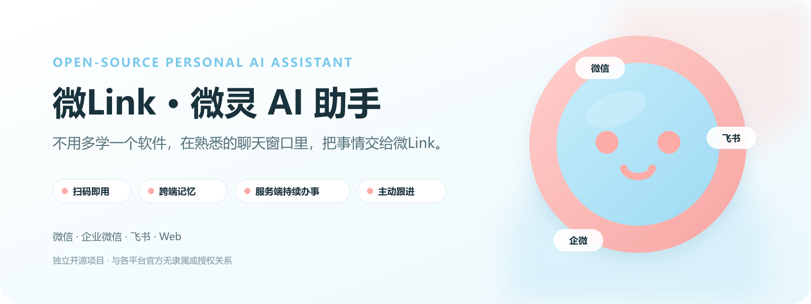
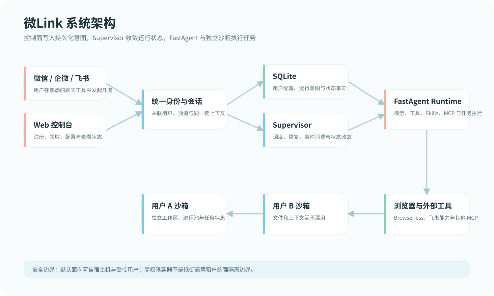

# weiling · Weiling AI Assistant

> Give an AI assistant a job from the chat app you already use. It keeps the context, runs suitable work in a server-side sandbox, and follows up when the task needs you again.

`weiling-ai-assistant` is a self-hosted, multi-user control plane for AI assistants. It brings together chat channels, model profiles, Skills, MCP tools, memory, schedules, proactive delivery, and per-user/Bot execution environments.

<p align="center">
  
</p>

## Why it exists

Weiling started as an idea for a friendly WeChat life assistant nicknamed “Little Claw” in July. Real usage exposed the friction of single-machine agents: setup overhead, work stopping with a sleeping computer, and no durable follow-up. The project grew into a server-hosted assistant that can be reached from WeChat, WeCom, Feishu, or the web when the corresponding credentials and permissions are configured.

## Highlights

- QR-based onboarding and a web control plane; no new desktop client is required for users.
- Shared task context across configured channels for the same Bot.
- Supervisor-managed long-running processes and remote sandbox pools.
- Per-user/Bot workspaces and persisted runtime intent in SQLite.
- Skills, MCP, browser automation, document work, reminders, and scheduled jobs.
- Optional multi-user deployment with explicit security boundaries and admin controls.

Support is conditional on channel credentials, upstream platform policies, and an end-to-end check of your deployment. This project is not affiliated with Huawei WeLink, WeChat/WeCom, Feishu/Lark, or their owners.

## Quick start

Requirements: Node.js 20+, pnpm 9, a model-provider API key, and (for production) Docker Compose.

```bash
pnpm install
pnpm prepare:fastagent
cp .env.example .env
pnpm db:generate
pnpm db:migrate
pnpm dev:web
pnpm dev:supervisor
```

Open <http://localhost:3000>, create a model profile, create a Bot, and configure the channel you want to test.

For Docker:

```bash
cp infra/compose/.env.example infra/compose/.env
# Set APP_BASE_URL, BETTER_AUTH_SECRET, and BROWSERLESS_TOKEN.
docker compose --env-file infra/compose/.env -f infra/compose/docker-compose.yml up -d
```

The base stack starts Web, Supervisor, and sandbox-runtime. Add `--profile browserless` when you need browser automation, screenshots, PDFs, or the poster demo:

```bash
docker compose --profile browserless --env-file infra/compose/.env -f infra/compose/docker-compose.yml up -d
```

See the [Chinese getting-started guide](docs/getting-started.md), [Docker guide](docs/deployment/docker-compose.md), and [security model](docs/security-model.md).

## Architecture

The web app writes durable intent. Supervisor reconciles that intent and owns child-process lifecycle. FastAgent runs the assistant, while sandbox-runtime provides remote execution pools.

<p align="center">
  
</p>

## Repository layout

```text
apps/web/          Next.js control plane and APIs
apps/supervisor/  child-process lifecycle and channel gateways
packages/db/      SQLite schema, migrations, repositories
packages/shared/  shared contracts and path rules
infra/compose/     local and production Compose topology
infra/docker/      application image definitions
resources/skills/  managed Skills and their manifests
docs/              getting-started, deployment, security, and operations guides
```

## Contributing and license

Please read [CONTRIBUTING.md](CONTRIBUTING.md), [SECURITY.md](SECURITY.md), and [THIRD_PARTY_NOTICES.md](THIRD_PARTY_NOTICES.md) before opening a PR. Application code is MIT-licensed; upstream and third-party components keep their own notices. See [UPSTREAM.md](UPSTREAM.md) for project lineage.
