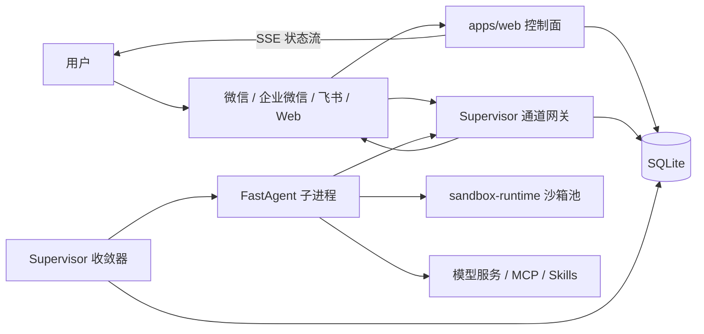

# 架构说明

微Link的核心思路是把“用户想让 Bot 做什么”和“现在有哪些进程在工作”分开。这样网页重启、Supervisor 重启或单个 Bot 异常时，系统仍有机会根据 SQLite 中的持久化意图恢复。

## 组件关系

## 每层负责什么

### Web

Web 负责认证、模型配置、Bot 管理、启动/停止意图、SSE 状态、公开二维码分享和管理员页面。它不应该直接拉起或杀掉 FastAgent 子进程；用户点击“启动”时，Web 写入持久化的期望状态。

### SQLite 与共享契约

SQLite 保存账号、Bot、模型配置、通道配置、运行意图、连接状态、投递回执和迁移记录。`packages/shared` 提供路径规则、JSONL 事件和沙箱池默认值等跨工作区契约。

### Supervisor

Supervisor 周期性读取运行意图，启动、停止、重启和收敛每个 Bot 子进程；它消费 FastAgent 的 JSONL 事件，并把二维码、运行状态、错误和投递结果持久化。企业微信、飞书等长连接网关也由 Supervisor 持有。

### FastAgent

FastAgent 是实际运行智能体的外部运行时：解析用户消息、调用模型、使用工具、Skills、MCP、记忆和定时任务。微Link通过命令行和 JSONL 事件契约接入，不依赖 FastAgent 的内部包结构。

### sandbox-runtime

sandbox-runtime 为每个用户/Bot 提供远程执行进程池和工作区。它降低多个 Bot 互相覆盖文件、共享进程或拿错凭据的概率，但高权限容器配置仍要求可信宿主机；完整边界见 [安全模型](security-model.md)。

## 一条消息的生命周期

1. 通道网关收到文本、语音转写或文件事件。
2. 网关根据通道身份和 Bot 绑定找到用户/Bot。
3. Supervisor 为该 Bot 复用或创建 FastAgent 子进程。
4. FastAgent 在该 Bot 的会话中读取上下文，按需调用 Skill、MCP 或沙箱工具。
5. 子进程通过 JSONL 回传中间状态、文件标记、错误或最终文本。
6. Supervisor 落库并通过通道网关投递；Web 端通过 SSE 更新状态。
7. 需要后续动作的任务可写入定时任务/投递队列，之后由 Supervisor 主动尝试发送并记录结果。

## 用户隔离边界

隔离由多层共同提供：

- 数据层按用户和 Bot 关联记录；
- 每个 Bot 使用独立实例目录和会话键；
- 沙箱池和工作区按用户/Bot 分配；
- Supervisor 给子进程注入经过 allowlist 的环境变量；
- 通道入口按绑定关系路由，不能把群聊或私聊身份当成全局用户。

这些措施不替代宿主机硬化、密钥管理、第三方服务审计和网络策略。不要把 Docker socket、SSH 密钥、云凭据或整个宿主机目录挂进沙箱。

## 故障恢复

- Web 重启：SQLite 中的 Bot 运行意图保留，页面恢复后可继续查看状态。
- Supervisor 重启：按持久化意图重新收敛子进程；重复启动由实例状态和退避逻辑避免。
- FastAgent 退出：Supervisor 记录退出原因并按策略重启或等待人工操作。
- 通道断线：企业微信/飞书网关尝试重连；主动投递使用回执和幂等键避免重复发送。
- 沙箱池异常：Bot 可能暂时无法执行工具，但应返回可解释的错误；先看 [监控](operations/monitoring.md)。
