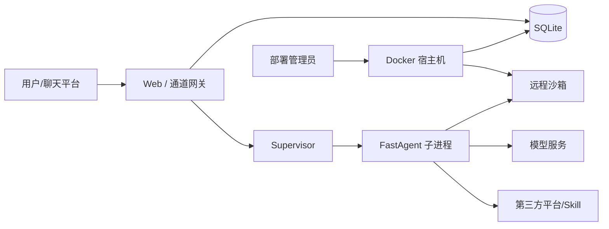

# 安全模型与已知边界

微Link的设计目标是：在可信宿主机上，为受控用户提供多个相互分开的 Bot 工作区和可持续的服务端执行。它不是面向互联网陌生用户的无条件代码执行平台，也不是已经完成合规认证的 SaaS。

## 数据流和信任边界

信任顺序大致是：宿主机/管理员 > 微Link控制面 > Bot 运行时 > Skill/模型/外部平台。聊天内容和 Skill 指令都可能是不可信输入，不能因为模型“看起来理解了”就跳过权限确认。

## 微Link提供的隔离

- 用户、Bot、模型配置和投递记录在 SQLite 中有明确关联；
- Bot 实例使用独立目录、会话键和工作区；
- 远程 sandbox-runtime 提供按用户/Bot 划分的沙箱池；
- Supervisor 向子进程注入 allowlist 环境，不把数据库和管理员 Secret 全量传给 Bot；
- 通道按身份绑定路由；群聊不应读取其他群或私聊上下文；
- 外部发送、文件和提醒有状态/回执，便于查重和恢复。

## 不能当成什么

- 不是内核级沙箱：配置中可能需要 SYS_ADMIN、NET_ADMIN、seccomp=unconfined 或 apparmor=unconfined；高风险代码需独立 VM、gVisor 或 Kata。
- 不是密钥保险箱：SQLite、实例目录、Lark 配置、日志和模型配置应被视为敏感数据。
- 不是平台策略绕过器：微信主动消息、企业微信绑定、飞书 scope 和群权限仍由平台控制。
- 不是自动合规系统：部署者要自己决定留存、访问、删除、跨境、客户同意和审计要求。
- 不是“只要容器健康就安全”：容器重启、Web 登录和 /login 200 不能代替通道、模型和文件 E2E 验证。

## 重点控制

### 身份与权限

- 关闭公开注册，使用管理员白名单和邀请码；
- 分离管理员、普通用户、测试账号和生产账号；
- 每个 Bot 只配置它实际需要的模型/通道；
- 不共享用户 OAuth Token、Cookie、SSH Key 或云凭据；
- 对公开二维码设置有效期并随时撤销。

### 文件和网络

- 沙箱默认拒绝读取敏感系统文件、SSH、云凭据和环境文件；
- 写入默认限制在工作区/允许路径；
- 出站网络按任务需要限制域名和端口；
- 不挂载宿主机根目录、Docker socket 或无关用户目录；
- 文件发送前确认相对路径、收件人和数量。

### 任务与主动投递

- 长任务要有状态、超时、幂等键和取消路径；
- 主动消息失败不自动无限重试；
- 没收到消息时先查投递记录和平台限制；
- 重要操作先生成草稿，明确确认后再写入/发送。

## 发布时的最低承诺

公开 README 可以说“按用户/Bot 划分工作区和沙箱”，但不能说“绝对隔离”“防止所有恶意代码逃逸”或“所有平台主动消息都可靠”。任何宣传用图必须通过二维码、账号、文件、域名、Token 和日志脱敏审查。

更多发布前检查见 [SECURITY.md](../SECURITY.md) 和 [生产加固](deployment/production-hardening.md)。
