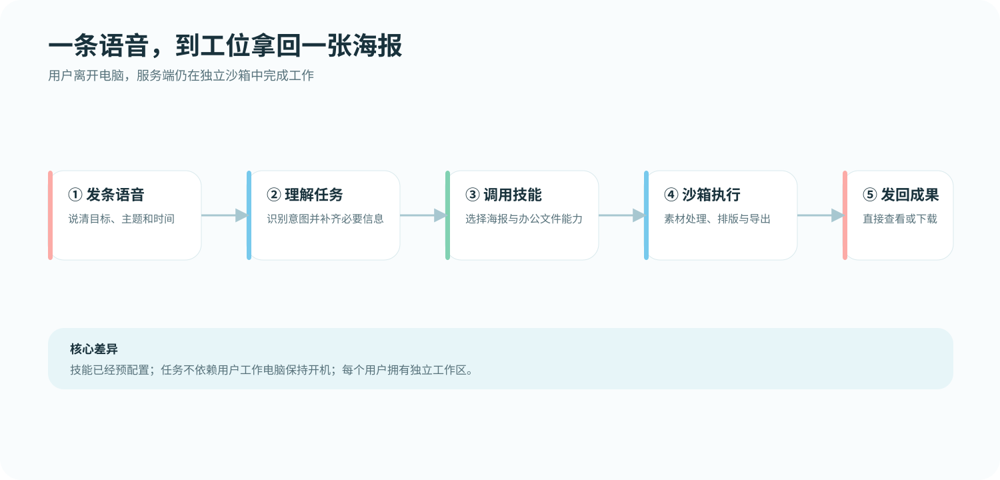

# 教程：发一条语音，拿回一张海报

这个教程用一个低风险的演示任务展示微Link的完整链路：聊天入口收到语音 → FastAgent 理解意图 → Skill 在服务端沙箱里准备页面和素材 → 返回一张可以继续使用的图片。

## 预期结果

你会得到一张 PNG/JPG 海报或可预览的 HTML 文件。具体输出取决于已同步的 Skill、模型能力和 Browserless 配置。

## 前置条件

- Bot 已启动并能收发消息；
- 模型配置可用；
- `poster-design` 或其他实际使用且许可证已经核准的视觉 Skill 已同步；
- 需要浏览器导出的路径已配置 Browserless；
- 沙箱工作区有足够磁盘空间；
- 使用演示素材和测试文案，不要上传客户资料。

## 发送示例

在微信、企业微信、飞书私聊或 Web 中发送一条语音，内容可以是：

```text
帮我做一张周五下午茶海报：
标题是“春日茶歇”，周五 15:00，地点写“会议室 A”。
画面清爽、留白多，先生成一版预览，不要发送给其他人。
```

若语音识别不可用，直接发同样的文字。为避免执行歧义，先让微Link生成预览，不要一开始要求对外发送。

## 运行过程中看什么

1. 通道显示已收到消息。
2. Web/Supervisor 日志显示 Bot 正在处理，而不是反复重启。
3. Skill 生成 HTML/图片时，文件落在当前 Bot 的工作区。
4. 任务完成后返回文件或相对路径标记。
5. 通过 Web、聊天入口和文件实际打开验证结果，不要仅根据“已完成”文字判断。

<details>
<summary>演示素材占位图</summary>



公开 GIF 必须使用失效二维码、虚拟账号和无敏感信息的示例文案。
</details>

## 检查清单

- [ ] 标题、时间、地点和字体大小正确；
- [ ] 没有生成真实电话号码、账号、客户名或未经授权的 Logo；
- [ ] 图片可打开，尺寸适合发送；
- [ ] 结果文件在当前 Bot 工作区，没有写入宿主机其他目录；
- [ ] 未执行“发送给其他人”或外部发布；
- [ ] 如果后续要发送，先确认收件人、内容、文件和数量。

## 常见问题

| 现象 | 排查 |
| --- | --- |
| 只回复文字，没有文件 | 检查对应 Skill 是否同步、Browserless 是否可用、模型是否理解文件输出契约。 |
| 任务超时 | 查看沙箱/Browserless 日志，确认磁盘、内存和并发；先询问状态，不要重复提交。 |
| 图片中文乱码 | 检查沙箱字体和模板；公开素材中使用确定性字体排版。 |
| 文件已生成但聊天没有收到 | 检查通道的文件标记、相对路径、大小限制和投递回执。 |
| 生成了不该出现的品牌元素 | 只使用自有或已授权素材，删除第三方 Logo，重新生成并复核。 |

## 下一步

把这次任务改成“明天 10 点提醒我确认海报”，体验 [主动提醒](proactive-reminders.md)；想了解为什么电脑关机后任务还能继续，阅读 [架构说明](../architecture.md)。
